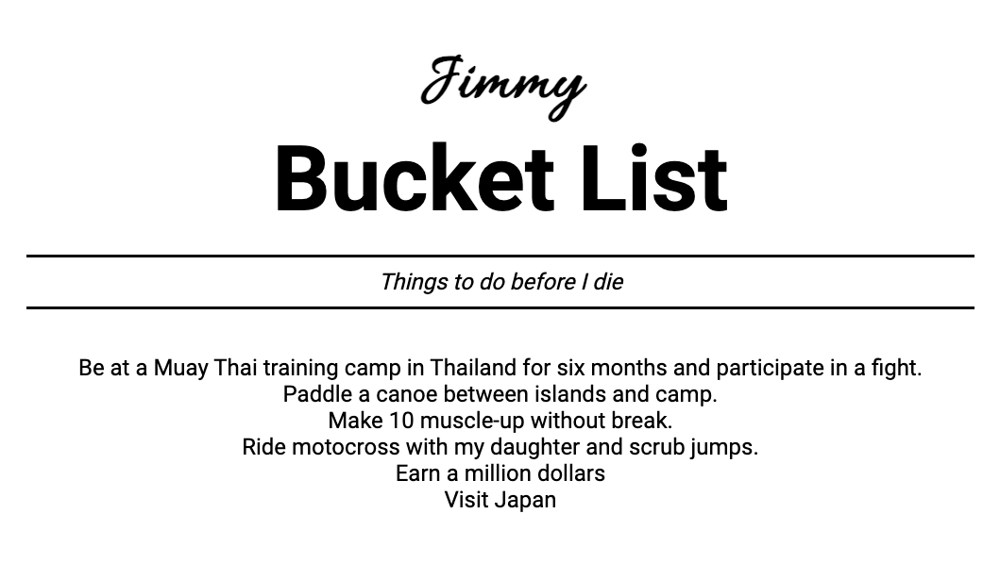

# Jimmy's BucketList

This is a bucket list exercise where I have to create elements and append them to the HTML file using DOM manipulation in vanilla JavaScript.

[Go to Exercise Criteria](#bucket-list)

<figure></figure>

## Some of the method used to solve this exercise

- querySelector
- createElement
- appendChild
- insertAdjacentElement
- insertAdjacentHTML
- parentNode
- replaceChild

## Code Snippets Solutions

1. Create a `<p>` using the `createElement` method. When you have a reference to your new element, change its `innerText` to something that you would like to have on your bucket list, and then append it to the DOM with the `appendChild` method. Where does this element go? How can you get it do be added directly after the already existing `<p>`.

   ```js
   const list = document.querySelector('.list');
   const p1 = document.createElement('p');
   p1.innerText = 'Visit Japan';
   list.appendChild(p1);
   ```

2. Create another `<p>` with an item you would like to have on you bucket list. This time add it to the DOM, right after your existing `<p>`-tags with the help of the `insertAdjecentElement` method. This method accepts a position argument. Which value should that argument have?

   ```js
   const p2 = document.createElement('p');
   p2.innerText = 'Vanlife for 1 year.';
   list.insertAdjacentElement('beforeend', p2);
   ```

3. `innerHTML` is an interesting property that exists on HTML elements. With that property we can get and set the inner HTML of a HTML element very easy. Try to get _(or do you already have it?)_ the inner HTML from the element that contains all the `<p>`-tags of your bucket list. Log that to the console.

   ```js
   console.log(list.innerHTML);
   ```

4. & 5. In order to set the `innerHTML` of an element we need to create a string that contains the HTML code that we want to add to the DOM. It can look something like this:

   ```html
   '
   <div>This is a div element as a string</div>
   '
   ```

   Now create that string that contains a new item that you want to add to your bucket list.

   Set the `innerHTML` of the list with the new item you just created. What happens when you do that?

   ```js
   const p4 = '<p>Take the Hurtigruten for one week and see whales.</p>';
   list.innerHTML = p4;
   console.log(list);
   ```

5. Comment out that previous line(s) of code and the three items that you had before you should exist again. How can you add that last item and still keep the three other ones? There is a method that is very similar to the `insertAdjecentElement` that will take your HTML string and add it to the list. Try to add your new item to the beginning of the list.

   ```js
   const p6 = '<p>Ride motocross with my daughter and scrub jumps.</p>';
   list.insertAdjacentHTML('afterbegin', p6);
   ```

6. Add three more items to the end of list, but try and do it with a loop instead. Less repetitive code.

   ```js
   const pS = [
     '<p>Own a Nissan GT-R 34 Nismo.</p>',
     '<p>Paddle a canoe between islands and camp.</p>',
     '<p>Work at a place where I enjoy being part of the team, and where we train together regularly.</p>',
   ];
   pS.forEach((p) => {
     list.insertAdjacentHTML('afterbegin', p);
   });
   ```

7. How many items do you have in your bucket list now? Log it to the console. Use the `children` property.

   ```js
   console.log('Bucket list length: ', list.children.length);
   ```

8. Change the content of the `h2` at the to top of the HTML document do have your name instead of "Bucky's";

   ```js
   const h2 = (document.querySelector('.owner').textContent = "Jimmy's");
   ```

9. Replace the first item in your list with a new item. There are several ways to do this, but try the `replaceChild` method out.

```js
const p7 = document.createElement('p');
p7.innerText =
  'Be at a Muay Thai training camp in Thailand for six months and participate in a fight.';
const firstBucketItem = document.querySelector('.list p');
firstBucketItem.parentNode.replaceChild(p7, firstBucketItem);
```

11. Now try replace an element in the middle of the list to a new one. Use the same method as before or get creative.

```js
const p8 = document.createElement('p');
p8.innerText = 'Make 10 muscle-up without break.';
const thirdPInList = list.querySelector('p:nth-child(3)');
thirdPInList.parentNode.replaceChild(p8, thirdPInList);
```

12. Remove the last element in the list. `lastChildElement` combine with the `removeChild` method might work.

```js
list.removeChild(list.lastChild);
```

# Bucket List

In this assignment you are going to create your bucket list but in a different way than you might be used it. It's _**forbidden**_ in this assignment to add elements, content, styling or anything else, inside your HTML document or CSS files. All of this will be handled through vanilla JavaScript.

The purpose of the assignment is to learn how we can create basic, and more advanced content, solely with JavaScript.

<figure></figure>

To get you started you are given a basic template of HTML and CSS code, but this is all you get. The rest you must create on your own. Follow the instructions below.

1. Create a `<p>` using the `createElement` method. When you have a reference to your new element, change its `innerText` to something that you would like to have on your bucket list, and then append it to the DOM with the `appendChild` method. Where does this element go? How can you get it do be added directly after the already existing `<p>`.

2. Create another `<p>` with an item you would like to have on you bucket list. This time add it to the DOM, right after your existing `<p>`-tags with the help of the `insertAdjecentElement` method. This method accepts a position argument. Which value should that argument have?

   - afterbegin
   - afterend
   - beforebegin
   - beforeend

   Try them out!

3. `innerHTML` is an interesting property that exists on HTML elements. With that property we can get and set the inner HTML of a HTML element very easy. Try to get _(or do you already have it?)_ the inner HTML from the element that contains all the `<p>`-tags of your bucket list. Log that to the console.

4. In order to set the `innerHTML` of an element we need to create a string that contains the HTML code that we want to add to the DOM. It can look something like this:

   ```js
   '<div>This is a div element as a string</div>';
   ```

   Now create that string that contains a new item that you want to add to your bucket list.

5. Set the `innerHTML` of the list with the new item you just created. What happens when you do that?

6. Comment out that previous line(s) of code and the three items that you had before you should exist again. How can you add that last item and still keep the three other ones? There is a method that is very similar to the `insertAdjecentElement` that will take your HTML string and add it to the list. Try to add your new item to the beginning of the list.

7. Add three more items to the end of list, but try and do it with a loop instead. Less repetitive code.

8. How many items do you have in your bucket list now? Log it to the console. Use the `children` property.

9. Change the content of the `h2` at the to top of the HTML document do have your name instead of "Bucky's";

10. Replace the first item in your list with a new item. There are several ways to do this, but try the `replaceChild` method out.

11. Now try replace an element in the middle of the list to a new one. Use the same method as before or get creative.

12. Remove the last element in the list. `lastChildElement` combine with the `removeChild` method might work.
